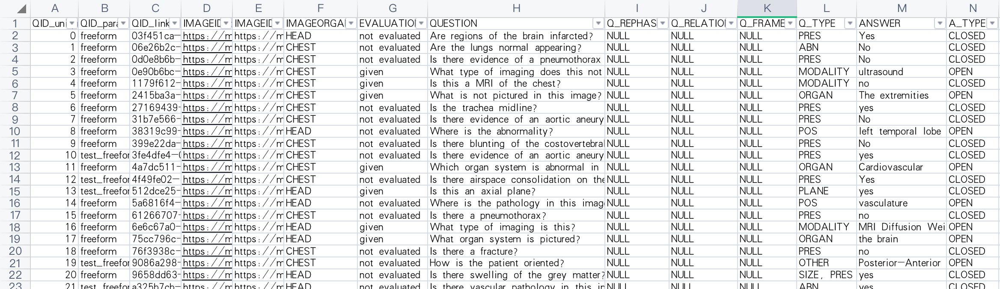

# sprint 3
Medical Visual Question Answering

Group: Ruiling Zhang, Yuko Ishikawa, Zihao Shen

## Overall:
We duplicate and test an open-source python project, which is based on pytorch.

https://github.com/tbmoon/basic_vqa

Then we try to use a medical VQA dataset.

https://github.com/Awenbocc/med-vqa

## Dataset

VQA-RAD is a manufactured data set in which the questions and answers are radiographic images provided by clinicians. There are 3,515 questions in 11 types. 

Clinical problems can be divided into four categories: modality problems, plane problems, organ system problems and abnormality problems. For the first three categories, QA uses a multiple choice (MC) style, with a fixed number of possible answers (36, 16, and 10, respectively). Therefore, QA tasks can be equivalently expressed as multipath classification problems with 36, 16, and 10 categories, respectively. This makes this data set much less difficult.

### 1) Modality
>Yes/No, WH and closed questions. Examples:  
>– was gi contrast given to the patient?  
>– what is the mr weighting in this image?  
>– what modality was used to take this image?  
>– is this a t1 weighted, t2 weighted, or flair image?  

### 2) Plane:
>WH questions.  
Examples:  
– what is the plane of this mri?  
– in what plane is this mammograph taken?  

### 3) Organ System:
>WH questions.  
Examples:  
– what organ system is shown in this x-ray?  
– what is the organ principally shown in this mri?  

### 4) Abnormality:
>Yes/No and WH questions.  
Examples:  
– does this image look normal?  
– are there abnormalities in this gastrointestinal image?  
– what is the primary abnormality in the image?  
– what is most alarming about this ultrasound?  


58% of QA in VQA-RAD are multiple choice questions, which means,  Most questions have a fixed number of candidate answers that can be sorted in a variety of ways. And the rest are open questions. The pictures are all about radiology. 



## code

```
for batch_idx, batch_sample in enumerate(data_loader[phase]):

    image = batch_sample['image'].to(device)
    question = batch_sample['question'].to(device)
    label = batch_sample['answer_label'].to(device, dtype=torch.long)
    multi_choice = batch_sample['answer_multi_choice']  # not tensor, list.

    optimizer.zero_grad()

    with torch.set_grad_enabled(phase == 'train'):

        output = model(image, question)      # [batch_size, ans_vocab_size=1000]
        _, pred_exp1 = torch.max(output, 1)  # [batch_size]
        _, pred_exp2 = torch.max(output, 1)  # [batch_size]
        loss = criterion(output, label)
```

Now we only use the part of question and answer, other information has not been used yet.

## Future work:
Medical VQA datasets are more challenging to construct than VQA datasets in the general field. For medical data, a piece of data is a patient's information. Medical images such as pathological images are highly domain specific, which can only be explained by well-educated medical professionals. 

Besides, to create a VQA dataset, a image dataset need to be collected first. Despite the ubiquity of images in the common domain, medical images are difficult to obtain because of privacy concerns.

For medical data, a piece of data is a patient's information. VQA-RAD is special, although it's small, it contants lots of information.

In next steps we will search for methods to make more effective use of the dataset information.